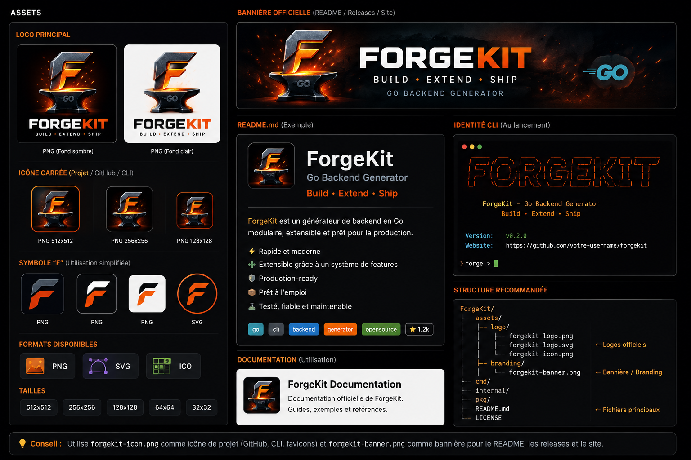

# ForgeKit

<p align="center">
  
</p>

<h1 align="center">ForgeKit</h1>

<p align="center">
  <strong>Go Backend Generator</strong>
</p>

<p align="center">
  Build • Extend • Ship
</p>

<p align="center">
  Generate production-ready Go REST APIs with a clean hexagonal architecture.
</p>

ForgeKit is a developer CLI written in Go that helps you bootstrap backend REST APIs without manually creating the same project structure, configuration, database integration, Docker files, migrations, and tests every time.

The goal is simple:

```text
forge init my-api
```

and get a structured Go backend ready for development.

---

## ✨ Features

- Generate Go REST APIs
- Hexagonal architecture
- PostgreSQL integration
- Docker and Docker Compose
- Database migrations
- Environment configuration
- Automatic tests
- Automatic Go formatting
- Architecture validation
- Development environment diagnostics
- Project analysis
- Human-readable or JSON output
- Extensible CLI architecture
- **Feature system (`forge add`) for extending generated projects**
- **JWT authentication infrastructure (`forge add auth`)**

---

## Installation

### From source

Requirements:

- Go 1.22+
- Git
- Docker (required for the generated project's Docker workflow)

Clone the repository:

```bash
git clone git@github.com:Demetrius-ch/forgekit.git
cd forgekit
```

Build ForgeKit:

```bash
go build -o forge ./cmd/forge
```

Install it globally:

```bash
go install ./cmd/forge
```

Verify the installation:

```bash
forge version
```

---

## Usage

### Initialize a project

```bash
forge init my-api
```

ForgeKit interactively asks for the project configuration and generates the backend.

You can also use non-interactive mode:

```bash
forge init my-api \
  --module github.com/example/my-api \
  --port 8080 \
  --db-name my_api \
  --non-interactive
```

Specify a target directory:

```bash
forge init my-api --dir /tmp/my-api
```

Preview the files without creating them:

```bash
forge init my-api --dry-run
```

---

## Generated project

A generated project follows a structure similar to:

```text
my-api/
├── cmd/
│   └── server/
│       └── main.go
│
├── internal/
│   ├── application/
│   │   ├── health/
│   │   └── user/
│   │
│   ├── domain/
│   │   ├── health.go
│   │   └── user.go
│   │
│   ├── infrastructure/
│   │   ├── config/
│   │   └── postgres/
│   │
│   └── transport/
│       └── http/
│           ├── handler/
│           └── router.go
│
├── migrations/
│   ├── 000001_init.up.sql
│   └── 000001_init.down.sql
│
├── docker/
│   ├── Dockerfile
│   └── docker-compose.yml
│
├── tests/
├── .env.example
├── .gitignore
├── forge.yaml
├── Makefile
├── README.md
├── go.mod
└── go.sum
```

After installing features (e.g., `forge add auth`), the structure extends with:

```text
my-api/
├── internal/
│   └── auth/
│       ├── jwt.go
│       └── middleware.go
├── .forge/
│   └── features.yaml
└── .env.example  (extended with JWT_SECRET)
```

---

## Architecture

ForgeKit generates a backend organized around hexagonal architecture.

```text
                     ┌──────────────────────┐
                     │      HTTP API        │
                     │    Transport Layer   │
                     └──────────┬───────────┘
                                │
                                ▼
                     ┌──────────────────────┐
                     │    Application       │
                     │      Services        │
                     └──────────┬───────────┘
                                │
                                ▼
                     ┌──────────────────────┐
                     │       Domain         │
                     │   Business Logic     │
                     └──────────┬───────────┘
                                │
                                ▼
                     ┌──────────────────────┐
                     │   Infrastructure     │
                     │ PostgreSQL / Config   │
                     └──────────────────────┘
```

The objective is to keep business logic independent from infrastructure and transport concerns.

---

## Run the generated API with Docker

Enter the generated project:

```bash
cd my-api
```

Copy the environment configuration:

```bash
cp .env.example .env
```

Start the complete stack:

```bash
docker compose -f docker/docker-compose.yml up --build
```

The stack includes:

- PostgreSQL
- Database migrations
- Go API

The API is available by default on:

```text
http://localhost:8080
```

Test the health endpoint:

```bash
curl http://localhost:8080/health
```

Expected response:

```json
{
  "service": "my-api",
  "status": "ok"
}
```

---

## Extend a generated project with `forge add`

ForgeKit v0.2.0 introduces an extensible feature system to add capabilities to existing projects.

### List available features

```bash
forge add --list
```

Output:

```text
ForgeKit Features
────────────────────────────────
auth 1.0.0 — Infrastructure d'authentification JWT (middleware, validation de token)
```

### Preview a feature installation (dry-run)

```bash
forge add auth --dry-run
```

Output:

```text
ForgeKit Add
────────────────────────────────

✓ Projet ForgeKit détecté
✓ Feature "auth" trouvée
✓ Prérequis validés
✓ Plan validé


ForgeKit Add
────────────────────────────────
Feature : auth
Version : 1.0.0

Fichiers :
  → internal/auth/jwt.go
  → internal/auth/middleware.go

Dépendances :
  → github.com/golang-jwt/jwt/v5 v5.2.0

Variables d'environnement :
  → JWT_SECRET=your-secret-key-change-in-production

Aucune modification effectuée (--dry-run).
```

### Install a feature

```bash
forge add auth
```

Output:

```text
ForgeKit Add
────────────────────────────────

✓ Projet ForgeKit détecté
✓ Feature "auth" trouvée
✓ Prérequis validés
✓ Plan validé

Installation...
✓ Fichiers installés
✓ Dépendances installées
✓ Projet validé

────────────────────────────────
✓ Feature "auth" installée avec succès
```

The `auth` feature adds:

- `internal/auth/jwt.go` — JWT token generation and validation
- `internal/auth/middleware.go` — HTTP middleware for authentication
- Dependency: `github.com/golang-jwt/jwt/v5`
- Environment variable: `JWT_SECRET` in `.env.example`
- Tracks installation in `.forge/features.yaml`

### Idempotency

Running `forge add auth` twice is safe:

```bash
$ forge add auth
✓ Feature "auth" installée avec succès

$ forge add auth
⚠ Feature "auth" déjà installée
```

### JSON output

All commands support `--format json` for machine-readable output:

```bash
forge add --list --format json
forge add auth --dry-run --format json
```

### Quiet mode

Suppress non-essential output:

```bash
forge add auth --quiet
```

---

## Validate a generated project

ForgeKit provides several commands to help developers verify their project.

### Doctor

Check the development environment:

```bash
forge doctor
```

### Check

Validate architectural conventions:

```bash
forge check
```

### Analyze

Analyze the project:

```bash
forge analyze
```

### Run tests

Inside the generated project:

```bash
go test ./...
```

### Run static analysis

```bash
go vet ./...
```

---

## CLI

Display the available commands:

```bash
forge --help
```

Available commands include:

```text
add
analyze
check
completion
config
doctor
init
version
```

Global options:

```text
--debug
--format
--quiet
```

JSON output can be requested with:

```bash
forge --format json doctor
```

---

## Feature system architecture

ForgeKit v0.2.0 introduces a generic feature infrastructure in `internal/feature/`:

- **Feature interface** — Defines `Name()`, `Description()`, `Version()`, `Check()`, `Plan()`, `Apply()`
- **ProjectContext** — Project metadata (root, module, Go version)
- **Manifest** — Feature resources (dependencies, files, environment variables)
- **Plan** — Computed installation plan
- **Registry** — Feature registration and discovery
- **Detector** — Validates ForgeKit project structure
- **Installer** — Applies plans with rollback support
- **Installed tracking** — `.forge/features.yaml` records installed features

### Adding a new feature

1. Implement the `Feature` interface in `internal/feature/<name>/`
2. Add template files in `internal/template/api/internal/<name>/`
3. Register the feature in `internal/cli/commands.go` in `newAddCommand()`

---

## Limitations

Current v0.2.0 limitations:

- Only `auth` feature is implemented
- No `forge remove` command yet
- No feature version upgrade path (manual intervention required)
- Features must be registered in the CLI binary (no plugin system yet)

---

## ⚡ Why ForgeKit?

Creating a backend from scratch often means repeating the same work:

```text
Create directories
       ↓
Create Go modules
       ↓
Configure HTTP server
       ↓
Configure PostgreSQL
       ↓
Create migrations
       ↓
Create Docker files
       ↓
Create tests
       ↓
Configure environment
       ↓
Check architecture
       ↓
Format code
       ↓
Run tests
```

ForgeKit turns this repetitive process into:

```bash
forge init my-api
```

And extends it with features:

```bash
forge add auth
```

The developer can then focus on the actual business logic.

---

## Project philosophy

ForgeKit is not intended to hide Go from developers.

It is intended to eliminate repetitive boilerplate while keeping the generated project:

- readable
- conventional
- testable
- maintainable
- extensible
- understandable by any Go developer

The generated project belongs to the developer. ForgeKit does not create a proprietary runtime or lock the project into a framework.

---

## 🛣 Roadmap

### v0.1.0

- [x] Go REST API generation
- [x] Hexagonal architecture
- [x] PostgreSQL
- [x] Docker
- [x] Database migrations
- [x] Project tests
- [x] `forge doctor`
- [x] `forge check`
- [x] `forge analyze`

### v0.2.0

- [x] Feature system (`forge add`)
- [x] JWT authentication (`forge add auth`)
- [x] Idempotent feature installation
- [x] Dry-run support
- [x] JSON/quiet output modes
- [ ] Redis integration
- [ ] Swagger/OpenAPI generation
- [ ] Additional database options
- [ ] More project templates
- [ ] Better project analysis
- [ ] More automated architecture rules

### Future

Potential directions:

- [ ] Plugin system
- [ ] More backend architectures
- [ ] Microservice templates
- [ ] CI/CD generation
- [ ] Cloud deployment templates
- [ ] Templates for other ecosystems

---

## Contributing

Contributions are welcome.

Fork the repository, create a branch, make your changes, and open a pull request.

Before submitting a pull request, run:

```bash
gofmt -w .
go test ./...
go vet ./...
go build ./...
```

---

## License

See the repository license for details.

---

## Support the project

If ForgeKit is useful to you, consider starring the repository on GitHub.

Issues, feature requests, documentation improvements, and pull requests are welcome.

---

## Changelog

### v0.2.0 (2026-08-10)

- Added `forge add` command with extensible feature system
- Implemented `forge add auth` for JWT authentication infrastructure
- Added `--list`, `--dry-run`, `--format json`, `--quiet` flags
- Added progress display with spinners and colored output
- Added `.forge/features.yaml` for tracking installed features
- Added rollback mechanism for failed installations
- Added comprehensive unit tests for feature system
- Updated generated project structure with `internal/auth/`

### v0.1.2

- Initial release with `forge init`, `forge doctor`, `forge check`, `forge analyze`
- Hexagonal architecture scaffolding
- PostgreSQL, Docker, migrations, tests

---

**ForgeKit — Build the backend, not the boilerplate.**
